<!--
  ATENÇÃO: troque todas as ocorrências de SEU_USUARIO_GITHUB pelo seu usuário real do GitHub
  (usado nas seções de stats, streak, top languages, troféus, snake e contador de visitas)
-->

  

  
  
  

 

## 🏜️ Sobre mim

<table>
<tr>
<td width="65%" valign="top">

> *Como a areia de Arrakis nunca para de se mover, a tecnologia também não —*
> *e eu sigo aprendendo a atravessar as duas.*

Olá! Eu sou o **Odílio Carneiro**, estudante de **Técnico em Informática no IFCE, campus Fortaleza**.
Curioso por natureza, gosto de entender como as coisas funcionam por baixo do capô — seja um sistema, uma rede ou uma linha de código.

- 🔭 Atualmente aprofundando conhecimentos em **Python, JavaScript, Java e Swift**
- 🌱 Sempre estudando algo novo em tecnologia
- 🎬 Fã declarado do universo de **Duna**
- 🦥 Adora um bom café e um bom debug

</td>
<td width="35%" align="center">
  
</td>
</tr>
</table>

 

## 🐍 Tecnologias

  

 

## 📊 Estatísticas do GitHub

  
  

  

  

 

## 🐛 A cobra que atravessa o deserto

  <picture>
    <source media="(prefers-color-scheme: dark)" srcset="https://raw.githubusercontent.com/SEU_USUARIO_GITHUB/SEU_USUARIO_GITHUB/output/github-snake-dark.svg" />
    
  </picture>

<i>⚙️ essa animação exige um passo extra de configuração — veja as instruções abaixo</i>

 

  

